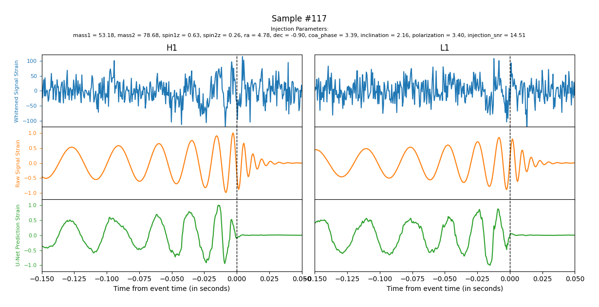

# uNet-CBC: applying U-net to detect compact binary coalescence

This repository illustrates the use of U-net convolutional architecture as a possible aid in the detection of Compact Binary Coalescence (CBC). Created to be trained on simulated or real gravitaional wave data from [*ggwd: generate gravitational-wave data*](https://github.com/timothygebhard/ggwd/tree/master), this model has achieved relatively good performance for denoising raw signal waves from noisy observations from detectors.

## Quickstart

You can begin by cloning the repository:

```
git clone https://github.com/macsencasaus/uNet-CBC.git
```

Then install the necessary packages (ideally in a fresh virtual environment):

```
pip install -r requirements.txt
```
To begin training the U-net simply run on the sample data:

```
python train_model.py
```

This will train the model, on the demo training data, and save it to the `./outputs/models` directory. Check out the documentation to see how to change the training parameters and data in order to fine tune the model to your specifications.

The model can then be evaluated using:

```
python apply_model.py
```

This will generate predictions and evaluate the model based on the demo testing data and save it to the `./outputs/predictions` directory.

Finally, you can use the `plot_event.py` script to visualize the model's predictions in comparison against the testing data found in the `./outputs/figures` directory. These outputs look something like this :



You may specify a different sample by using the `--sample-id` flag with the index of the sample you desire to plot.

## Documentation

The documentation for all code can be found as `.md` files in the `./docs` directory.


## Authors

The code in this repository is developed by [Macsen Casaus](https://github.com/macsencasaus).

## Acknowledgements

A huge thank you to [Timothy Gebhard](https://github.com/timothygebhard) for the guidance and expertise he has provided during this project.